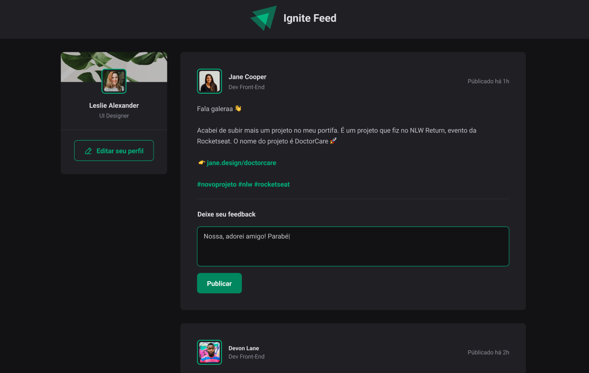

# Ignite Feed

## Sobre
O Ignite Feed é uma aplicação onde simulamos um feed de posts de usuários. O intuito foi praticar os fundamentos e conceitos do React, tais como propriedades, estado, imutabilidade, iterações, closures, css escopado usando css modules, typescript etc.

Você pode encontrar o Figma do projeto aqui: 

- [Figma](https://www.figma.com/community/file/1113573231685349036)


## 🧪 Tecnologias

Esse projeto foi desenvolvido com as seguintes tecnologias:

- [React](https://reactjs.org)
- [TypeScript](https://www.typescriptlang.org/)

## 🔗 Acesso
Você pode acessar o site de produção do repositório através do link:

- [ignite-feed](https://pecorario.github.io/ignite-feed/)

## 🚀 Como executar

Clone o projeto e acesse a pasta do mesmo.

```bash
$ git clone https://github.com/Pecorario/ignite-feed.git
$ cd ignite-feed
```

Para iniciá-lo, siga os passos abaixo:
```bash
# Instalar as dependências
$ npm i

# Iniciar o projeto
$ npm run dev
```
O app estará disponível no seu browser pelo endereço http://localhost:3001.